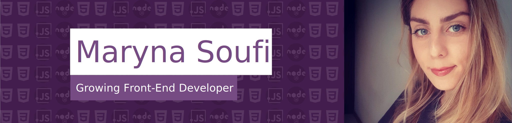

Hello, My name is Maryna Soufi
I am currently student at [Artevelde university of applied sciences](https://www.artevelde-uas.be/programmes/associate-degree/computer-programming) associate degree in computer programming.

## Contact

:house_with_garden: Heusden 9070, East Flanders, Belgium

:mailbox: xysamemir@gmail.com

## Social

## Education

- Master degree in dentistery 2007-2012 [Kharkiv National Medical University](http://www.knmu.kharkov.ua/index.php?lang=en) in Ukraine
- Internship in Dental surgery 2012-2014 in Ukraine
- Bachelor in new multimedia technologies from [Howest](https://mct.be/) in 2019-2020 Kortrijk Belgium
- 2020-2022 Associate Degree in programming from [Artevelde university of applied sciences](https://www.artevelde-uas.be/programmes/associate-degree/computer-programming) Gent Belgium

## Skills

### Web design

- 
- 
- 
### Front-End

- 
- 
- 
- 
- 
- 

### Back-end

- 
- 
- 
- 
- 
- 
- 
- 
- 

### Version Control

- 
- 

## Languages

- Russian
- English
- Dutch

## Interests

- Yoga
- Sport
- Travel
- History
## Github statics

